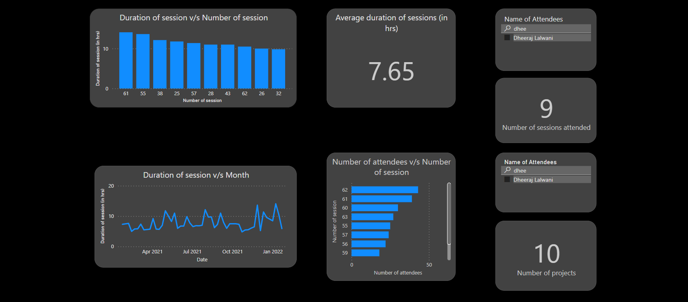

# OTC CatchUp Dashboard
<p>A Power BI dashboard analyzing OTC CatchUps.</p>

## File Contents
```
*
├───data
    ├───old summaries
        ─── *.md
    ├─── *.csv
├───scripts
    ├─── *.ipynb
├───results
└───
```
- data folder 
  - Contains markdown files of CatchUp summaries starting from CatchUp #11 to CatchUp #53 with a few missing.
  - Final csv files used to make visualizations.
- OTC CatchUp summary scraper.ipynb - Code to scrape OTC catchup summaries from CatchUp #54 available on the [OTC website](https://catchup.ourtech.community/summary).
- old otcs.ipynb - Code to extract relevant data from the summaries and saving it to  old_otcs.csv.
- data cleaning.ipynb - Code to merge the csv files and get all the columns in the right format for visualization.

## Results
<p align="center">
  
</p>

- The first graph shows the duration of the sessions in descending order. OTC CatchUp #61 was the longest session which went on for 14.08 hours i.e. 14 hours 6 minutes
- The second graph displays the duration of the session as per the date of the session.
- The average duration of the sessions is found to be 7.65 hours i.e. 7 hours 39 minutes.
- The number of attendees v/s the number of session is plotted in the third graph.
- OTC CatchUp #62 was found to have most number of attendees with 43 attendess.
- The number of sessions attended and the number of projects showcased by a person can be viewed by applying the respective filters.

Note: The data regarding attendees consists of data from OTC CatchUp #54 to CatchUp #63 only.

Special mentions to [Dheeraj Lalwani](https://github.com/dheerajdlalwani) for providing the data for CatchUp #11 to CatchUp #53 summaries.

You can find the dashboard [here](https://mihikagaonkar.github.io/OTC-Dashboard/)